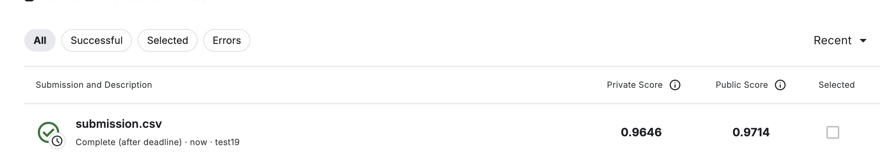

## Project Overview

This project focuses on the Kaggle Histopathologic Cancer Detection challenge. The main objective is to develop a machine learning model that can automatically detect metastatic cancer in small image patches extracted from large digital pathology scans. These scans show sections of lymph node tissue, and the task is to correctly classify whether each patch contains cancerous cells or not. The aim is to assist pathologists by improving the accuracy and efficiency of cancer detection through automated image analysis.

This project develops a binary classification model to identify cancerous tissue in small image patches extracted from lymph node digital pathology scans. The solution achieves **99.52% AUC** on the validation set using a DenseNet121 architecture with transfer learning.

## Submission Results

## Model Architecture

**DenseNet121** with custom classifier head:
- Pretrained on ImageNet for transfer learning
- Modified classifier with dropout, batch normalization, and ReLU activations
- Total parameters: 7,480,193
- Binary classification output with BCEWithLogitsLoss

## Key Features

- **Data Augmentation**: Random flips, rotations (180°), color jitter, affine transforms, Gaussian blur, and random erasing
- **Test-Time Augmentation (TTA)**: 5 augmented versions per test image to improve prediction stability
- **Optimization**: AdamW optimizer with Cosine Annealing scheduler and early stopping

## Results

| Metric | Value |
|--------|-------|
| Validation AUC | 99.52% |
| Validation Accuracy | 98.0% |
| Optimal Threshold | 0.5 |
| Precision (Tumor) | High |
| Recall (Tumor) | 96.2% |

**Confusion Matrix**:
- True Negatives: 25,661 (98.0% specificity)
- True Positives: 17,151 (96.2% sensitivity)
- False Positives: 521
- False Negatives: 672

## Exploratory Analysis

The notebook includes comprehensive EDA:
- PCA and t-SNE dimensionality reduction visualizations
- Pixel intensity distribution analysis across RGB channels (blue channel shows strongest class separation)
- Class distribution visualization
- Augmentation effect demonstrations

## What helped improve performance:

Transfer learning from pretrained model helped improve the model’s performance by providing strong initial feature representations. This was particularly important because the dataset was relatively small, and starting from pretrained weights allowed the model to generalize better without overfitting to limited data.

Domain-specific data augmentation, including rotations, flips, and color jitter, also played a key role in improving performance. These augmentations exposed the model to a wider variety of tissue slide variations, helping it handle real world variability and improving its ability to generalize to unseen images.

Test-time augmentation (TTA) provided an additional boost in accuracy. By averaging predictions across multiple augmented versions of each image during inference, the model’s predictions became more robust and reliable.

Regularization techniques such as dropout, batch normalization, and early stopping were essential for preventing overfitting. Dropout helped the model avoid relying too heavily on specific neurons, batch normalization stabilized training, and early stopping ensured the model did not overfit the training data.

Finally, learning rate scheduling contributed to faster and more stable convergence. Adjusting the learning rate during training allowed the optimizer to make more efficient updates, improving overall performance and reducing the risk of getting stuck in local minimal.

## What did not help much

1. Trying more complex architectures beyond DenseNet121, like DenseNet201 or other models with more parameters, did not show significant improvement in the validation result,  it also slowed training without clear gains.

2. Increasing the amount of standard augmentation like the differen rotations or heavy color changes sometimes made training unstable and reduced validation performance.

## Future improvements and ideas:

1. Experimenting with ensembles of multiple models could improve robustness and final accuracy, but it will take more time for training multiple models, so it's not implemented in this assignment.

2. Exploring advanced augmentation methods such as MixUp or CutMix might help the model generalize even better. 

3. Using larger pretrained models like EfficientNet or vision transformers could capture more complex features, although they would require more computational resources.

4. Incorporating attention mechanisms might help the model focus on subtle regions of interest in tissue.

5. The training dataset could be further augmented by using test dataset images with high confidence predicited images.